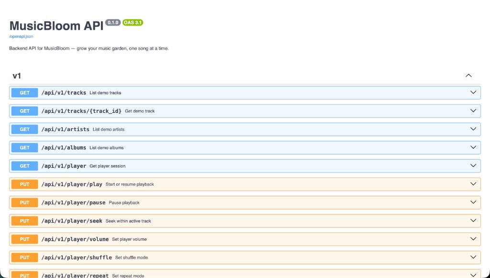
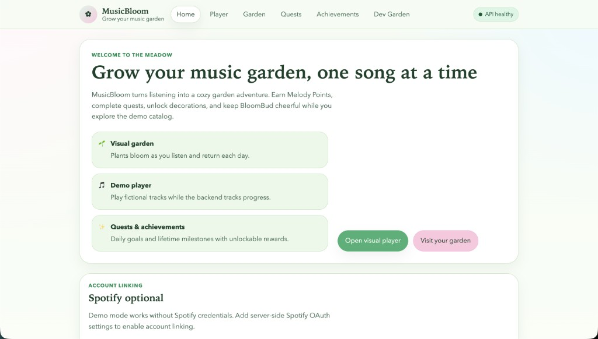
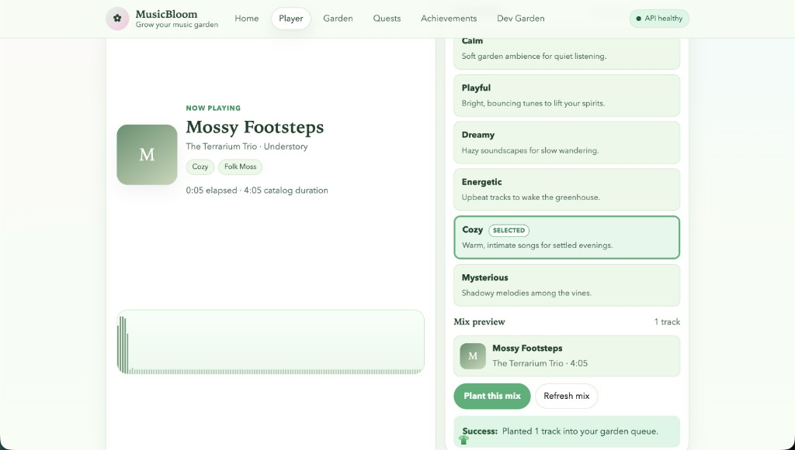
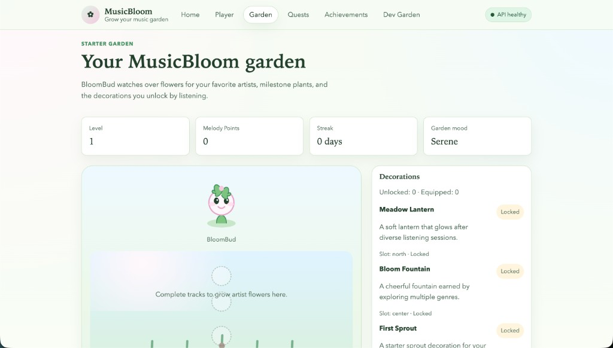
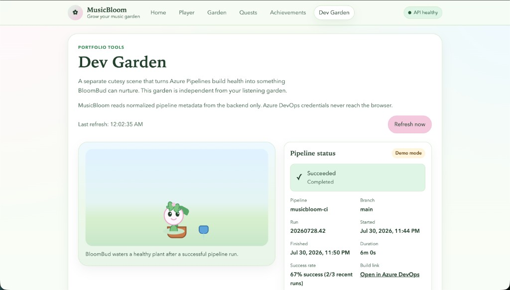
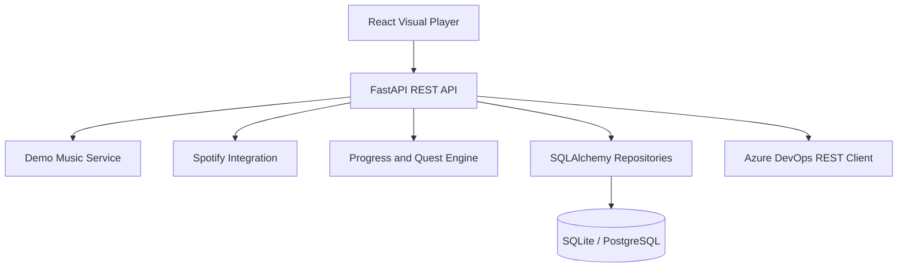

# MusicBloom

**Grow your music garden, one song at a time.**

MusicBloom is a full-stack application that turns listening into garden progression. A React visual player talks to a typed FastAPI backend for catalog, playback sessions, queue control, Melody Points, quests, and achievements. Optional Spotify and Azure DevOps integrations add live metadata and CI visualization, while demo mode runs the entire product without external credentials.

## Application Preview

### FastAPI OpenAPI documentation

Versioned REST routes for the demo catalog, player session, queue, and progression systems:



### Product UI









## Key Features

- Visual music player with playback controls, queue management, and listening-event sync
- **BloomMix** — mood-based five-track preview generation and planting into the server-backed queue
- Garden progression with Melody Points, quests, achievements, decorations, and BloomBud
- FastAPI REST API with persistent player sessions and a demo music catalog
- Optional Spotify OAuth for connection status, playback metadata, and remote controls
- **Dev Garden** — Azure Pipelines health visualized separately from the listening garden
- Demo mode that works without Spotify or Azure DevOps credentials

## Technical Highlights

- React, TypeScript, Vite, React Router, and TanStack Query on the frontend
- Python, FastAPI, Pydantic, and SQLAlchemy 2 on the backend
- SQLite by default with PostgreSQL-compatible persistence
- Alembic migrations for schema evolution
- Typed frontend API client shared with the React Query layer
- RESTful `/api/v1` design with interactive OpenAPI docs at `/docs`
- Backend tests with pytest; frontend tests with Vitest and React Testing Library
- Ruff, mypy, ESLint, and TypeScript project type checking
- Azure Pipelines CI for lint, typecheck, tests, builds, and artifacts
- Docker multi-stage image and Docker Compose demo stack
- Spotify and Azure DevOps secrets handled server-side; tokens are not exposed to the browser

## Technology Stack

| Area | Technologies |
|------|----------------|
| Frontend | React, TypeScript, Vite, React Router, TanStack Query |
| Backend | Python 3.12+, FastAPI, Pydantic, SQLAlchemy 2, Alembic |
| Data | SQLite (default), PostgreSQL-compatible |
| Quality | pytest, pytest-cov, Vitest, React Testing Library, Ruff, mypy, ESLint, TypeScript |
| Delivery | Azure Pipelines, Docker, Docker Compose |

## Architecture

The React client calls the FastAPI service. Domain services cover the demo catalog, player sessions, progression, and optional Spotify and Azure DevOps clients. Repositories persist state through SQLAlchemy to SQLite or PostgreSQL.



See [docs/architecture.md](docs/architecture.md) for a deeper architecture guide.

## Engineering Quality

- Backend coverage for `src/musicbloom` is enforced at **100%** via pytest (`--cov-fail-under=100`)
- Frontend integration and unit tests with Vitest and React Testing Library
- Static analysis with Ruff, mypy, ESLint, and `tsc`
- Azure Pipelines validates backend and frontend quality, tests, builds, and publishable artifacts
- Docker image and Compose stack support local demo review without committing production secrets
- Server-side credential handling for Spotify OAuth and Azure DevOps

## Quick Start

Requires Python 3.12+, Node.js 20+, and a virtual environment. Keep `.env` files local and uncommitted.

```bash
python3.12 -m venv .venv
source .venv/bin/activate
pip install -e ".[dev]"
cp .env.example .env
alembic upgrade head

uvicorn musicbloom.api.app:app --reload
```

In a second terminal:

```bash
cd web
cp .env.example .env
npm ci
npm run dev
```

- App: http://127.0.0.1:5173/
- API: http://127.0.0.1:8000/
- OpenAPI: http://127.0.0.1:8000/docs

## Demo Mode

`MUSICBLOOM_DEMO_MODE=true` (default in `.env.example`) runs the catalog, player, garden progression, and Dev Garden sample data without Spotify or Azure DevOps credentials. Optional integrations activate only when their environment variables are configured.

## Project Structure

```
musicbloom/
├── src/musicbloom/     # FastAPI app, services, models, repositories, integrations
├── web/                # React + TypeScript frontend
├── tests/              # Backend pytest suite
├── alembic/            # Database migrations
├── static/             # Demo audio and artwork
├── docs/               # Architecture notes and screenshots
├── azure-pipelines.yml
├── docker-compose.yml
├── Dockerfile
└── pyproject.toml
```

## Current Limitations

- Single demo user; no multi-user registration or login yet
- Quest and achievement pages are partly scaffold-level UI
- CI validates and publishes artifacts but does not deploy production
- Docker Compose demo stack is for local review, not hardened hosting
