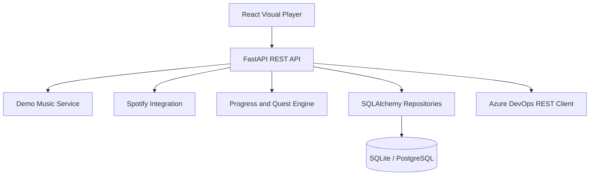

# MusicBloom

**Grow your music garden, one song at a time.**

MusicBloom is a portfolio-ready, full-stack application that turns listening into a
playful garden adventure. It combines a React visual player, FastAPI backend,
gamified progression, optional Spotify metadata integration, and an Azure DevOps
**Dev Garden** that shows CI health for recruiters and collaborators.

## Overview

MusicBloom demonstrates modern product engineering practices:

- Typed Python and TypeScript across the stack
- 100% backend test coverage with pytest
- Frontend integration tests with Vitest and React Testing Library
- Optional integrations that degrade gracefully in demo mode
- Azure Pipelines validation for backend, frontend, builds, and artifacts
- Dockerized demo deployment without production secrets in source control

## Screenshots

> Placeholder paths for portfolio screenshots. Replace these with real captures
> after running the app locally or in Docker.

| Screen | Placeholder |
|--------|-------------|
| Visual player | `docs/screenshots/player.png` |
| Listening garden | `docs/screenshots/garden.png` |
| Dev Garden | `docs/screenshots/dev-garden.png` |
| Quest board | `docs/screenshots/quests.png` |

## Feature summary

| Area | Highlights |
|------|------------|
| Visual player | Demo audio, queue, visualization, keyboard controls, listening-event sync |
| Garden & gamification | Melody Points, quests, achievements, decorations, BloomBud mascot |
| Spotify (optional) | OAuth connection, playback metadata, remote controls, no audio proxy |
| Dev Garden | Azure Pipelines health scene separate from the listening garden |
| API | Versioned FastAPI REST API with OpenAPI docs |
| Persistence | SQLAlchemy 2, Alembic migrations, SQLite or PostgreSQL |
| CI/CD | Azure Pipelines lint, typecheck, tests, builds, artifacts |
| Containers | Multi-stage Docker image and docker-compose demo stack |

## Architecture



See [docs/architecture.md](docs/architecture.md) for a deeper architecture guide.

## Vision

### Visual Player

A playful, garden-themed music experience that turns everyday listening into something you can see and nurture — not just hear.

### Garden & Gamification

- **Virtual garden** — songs and listening sessions help plants bloom and the garden flourish
- **Melody Points** — earn points for listening and completing activities
- **Quests** — guided goals that reward exploration and consistent listening
- **Decorations** — unlock and place items to personalize your garden
- **BloomBud** — a mascot whose mood and appearance respond to your listening habits

### Spotify Integration

Connect a Spotify account for live playback metadata and remote playback control. Demo mode continues to work without Spotify credentials.

### Azure DevOps Integration

Connect Azure Pipelines to power the **Dev Garden** with live build health for portfolio demos. Demo mode serves sample pipeline data without credentials.

## Technology Stack

| Layer | Technology |
|-------|------------|
| Backend language | Python 3.12 |
| API framework | FastAPI |
| Frontend | React, TypeScript, Vite |
| Frontend routing & data | React Router, TanStack Query |
| Validation | Pydantic |
| Backend testing | pytest, pytest-cov |
| Frontend testing | Vitest, React Testing Library |
| Linting | Ruff (Python), ESLint (web) |
| Type checking | mypy (Python), TypeScript (web) |
| Package layout | `src/` layout (Python), `web/` (frontend) |

## Current Development Status

This repository contains the **MusicBloom backend** and an initial **React web interface** under `web/`.

**Implemented today:**

- FastAPI application with typed Pydantic response models
- React + TypeScript frontend scaffold with garden-inspired UI shell
- Typed API client, TanStack Query provider, and `/api/health` status indicator
- Frontend routes for home, player, garden, quests, achievements, and dev garden
- Typed application configuration via `pydantic-settings`
- `GET /` — project metadata
- `GET /api/health` — health check
- `GET /api/v1/health` — versioned health check
- Demo music catalog API with fictional tracks, artists, and albums
- Player session API for demo playback control (metadata only; client-side audio)
- SQLAlchemy 2 persistence with Alembic migrations (SQLite default, PostgreSQL compatible)
- Database-backed player session storage with demo user seeding
- Listening progression system with Melody Points, experience, levels, and streaks
- Quest and achievement system with daily/weekly goals, unlockable rewards, and claim history
- Basic CORS middleware driven by configuration
- Development tooling configuration (pytest, Ruff, mypy)
- Interactive music garden with BloomBud mascot and decoration equip/unequip
- Spotify account connection with encrypted OAuth token storage
- Spotify playback metadata and remote control API (metadata only; no audio proxy)
- Azure DevOps pipeline status API for Dev Garden build health (demo mode supported)
- Dev Garden frontend that visualizes Azure Pipelines status separately from the listening garden
- Visual demo music player with native audio, metadata visualization, and listening-event sync

## Local development

### Prerequisites

- Python 3.12+
- Node.js 20+ and npm
- A virtual environment tool (`venv`, `uv`, etc.)

### Install

```bash
# Create and activate a virtual environment
python3.12 -m venv .venv
source .venv/bin/activate   # macOS / Linux
# .venv\Scripts\activate    # Windows

# Install the package with development dependencies
pip install -e ".[dev]"
cp .env.example .env
alembic upgrade head
```

### Run the API

```bash
# Via the CLI entry point
musicbloom

# Or directly with uvicorn
uvicorn musicbloom.api.app:app --reload
```

The API will be available at `http://127.0.0.1:8000`.

- Root: `http://127.0.0.1:8000/`
- Health: `http://127.0.0.1:8000/api/health`
- Versioned health: `http://127.0.0.1:8000/api/v1/health`
- Interactive docs: `http://127.0.0.1:8000/docs`

### Run the web interface

In a second terminal, start the Vite dev server:

```bash
cd web
cp .env.example .env
npm ci
npm run dev
```

The web app will be available at `http://127.0.0.1:5173`.

During local development, Vite proxies `/api/*` and `/static/*` requests to the
FastAPI backend at `http://127.0.0.1:8000`, so the health indicator, player, and
demo audio work without extra CORS configuration. For production builds, set
`VITE_API_BASE_URL` to your deployed API origin.

**Frontend routes:**

| Route | Purpose |
|-------|---------|
| `/` | Homepage with MusicBloom overview and player link |
| `/player` | Visual demo player with queue, controls, visualization, and listening events |
| `/garden` | Garden preview shell |
| `/quests` | Quest board scaffold |
| `/achievements` | Achievement gallery scaffold |
| `/dev-garden` | Azure DevOps Dev Garden with BloomBud pipeline scenes |

**Frontend commands:**

```bash
cd web
npm run dev       # Start Vite dev server
npm run build     # Production build
npm run preview   # Preview production build
npm run lint      # ESLint
npm run typecheck # TypeScript project references
npm run test      # Vitest (add -- --run for CI-style single run)
```

### Visual demo player

Open `http://127.0.0.1:5173/player` with **both** the FastAPI API and Vite dev server
running. The player:

- Loads catalog metadata and player-session state from the backend REST API
- Plays locally generated demo tones through the browser `<audio>` element
- Visualizes frequency data with the Web Audio API (no microphone access; nothing is
  uploaded to the server)
- Sends `started`, `progress`, `completed`, and `skipped` listening events with
  idempotency keys so the backend awards Melody Points and quest progress
- Shows a demo-mode banner, keyboard-accessible controls, ARIA labels, and graceful
  errors when demo audio files or fictional URLs are unavailable

**Generate demo audio files** (included in the repo after running once):

```bash
python scripts/generate_demo_audio.py
```

The API serves files from `/static/demo/audio/*.wav`. Tracks with fictional
`demo.musicbloom.local` URLs remain in the catalog to exercise unavailable-audio UI.

**Typical flow:**

1. Start the API and web dev servers.
2. Visit `/player` and press **Play** on a track with local demo audio (for example
   `Morning Dew Waltz`).
3. Use transport controls, seek bar, volume, shuffle, repeat, queue panel, and track
   browser.
4. Confirm listening events arrive via `POST /api/v1/listening/events` and awards
   appear in the player toast when granted by the server.

Audio never autoplays without an explicit click. Awards are always calculated by the
backend; the frontend only reports playback positions.

### Configuration

MusicBloom loads settings from environment variables (and an optional `.env` file)
using `pydantic-settings`. All application variables use the `MUSICBLOOM_` prefix.

Copy the example file and adjust values for your environment:

```bash
cp .env.example .env
```

| Variable | Default | Description |
|----------|---------|-------------|
| `MUSICBLOOM_ENVIRONMENT` | `development` | Runtime environment (`development`, `staging`, `production`) |
| `MUSICBLOOM_DEBUG` | `true` | Enable debug mode and auto-reload for local development |
| `MUSICBLOOM_DEMO_MODE` | `true` | Enable demo-mode behavior (disabled automatically in production) |
| `MUSICBLOOM_API_HOST` | `0.0.0.0` | Host address for the API server |
| `MUSICBLOOM_API_PORT` | `8000` | Port for the API server |
| `MUSICBLOOM_CORS_ORIGINS` | `http://localhost:3000,http://127.0.0.1:3000,http://localhost:5173,http://127.0.0.1:5173` | Comma-separated allowed CORS origins |
| `MUSICBLOOM_SECRET_KEY` | *(unset)* | Application secret; **required in production** (minimum 32 characters) |
| `MUSICBLOOM_DATABASE_URL` | `sqlite:///./musicbloom.db` | SQLAlchemy database URL (SQLite or PostgreSQL) |

**Production validation:** when `MUSICBLOOM_ENVIRONMENT=production`, the application
requires a strong `MUSICBLOOM_SECRET_KEY`, a `MUSICBLOOM_DATABASE_URL`, and enforces
`MUSICBLOOM_DEMO_MODE=false` and `MUSICBLOOM_DEBUG=false`.

Secrets are stored as `SecretStr` values and are masked in settings representations
to avoid accidental exposure in logs. Application secrets are never persisted in
the database.

Settings are cached through `musicbloom.dependencies.get_settings()` and injected
where needed by the application factory.

### Database

MusicBloom uses **SQLAlchemy 2** with **Alembic** migrations. The default development
database is local SQLite (`sqlite:///./musicbloom.db`). PostgreSQL is supported by
setting a PostgreSQL-compatible SQLAlchemy URL.

**Initialize and migrate locally:**

```bash
# Apply migrations
alembic upgrade head

# Create a new migration after model changes
alembic revision --autogenerate -m "describe change"
```

On application startup, the API initializes the configured database and, when
`MUSICBLOOM_DEMO_MODE=true`, seeds a default demo user with an empty player session,
starter garden profile, and initial progress records.

**Persisted entities:**

| Entity | Purpose |
|--------|---------|
| User profile | Local/demo user identity |
| Player session | Playback state, queue, and active track metadata |
| Listening event | Historical listening activity with idempotency keys |
| Garden profile | Garden name, theme, and layout data |
| User progress | Melody Points, experience, level, streaks, and listening totals |
| Track listening state | Per-track anti-exploit progress and completion tracking |
| Melody points transaction | Audited point awards with reasons and explanations |
| Equipped decoration | Decoration slotted in the garden |
| Achievement progress | Achievement completion state |
| Quest progress | Quest status and progress |

Tests use an isolated shared in-memory SQLite database.

Apply migrations after pulling progression changes:

```bash
alembic upgrade head
```

### Listening Progression API

The progression API validates listening events server-side and calculates all
Melody Points and experience awards using deterministic rules in
`musicbloom.progression.policy`. Client-supplied point totals are ignored.

| Endpoint | Description |
|----------|-------------|
| `POST /api/v1/listening/events` | Submit a listening event (idempotent) |
| `GET /api/v1/progress` | Combined progression summary |
| `GET /api/v1/stats` | Aggregate listening statistics |
| `GET /api/v1/streak` | UTC-based daily listening streak |

**Listening event types:**

| Type | Behavior |
|------|----------|
| `started` | Records playback start; awards no points |
| `progress` | Awards points for validated listening intervals |
| `completed` | Awards a one-time completion bonus when threshold is met |
| `skipped` | Marks the track skipped; no completion credit |

**Scoring highlights:**

- Progress awards require validated position advances within track duration
- Each track has capped progress rewards to prevent unlimited farming
- Completion bonuses are granted once per track per user
- Daily streak bonuses use UTC calendar dates and are capped per day
- Responses include transparent `awards` explanations for every grant

Example requests:

```bash
curl -X POST "http://127.0.0.1:8000/api/v1/listening/events" \
  -H "Content-Type: application/json" \
  -d '{
    "track_id": "demo-track-001",
    "event_type": "progress",
    "position_ms": 60000,
    "idempotency_key": "progress-001"
  }'
curl "http://127.0.0.1:8000/api/v1/progress"
curl "http://127.0.0.1:8000/api/v1/stats"
curl "http://127.0.0.1:8000/api/v1/streak"
```

### Quests, Achievements, and Rewards API

Quest and achievement progress is updated automatically from validated listening
events. Evaluation logic lives in `musicbloom.rewards.evaluator` and is kept
separate from route handlers. Demo quests and achievements are seeded with stable
IDs on database initialization.

| Endpoint | Description |
|----------|-------------|
| `GET /api/v1/quests` | Daily and weekly quests with progress and completion percentages |
| `GET /api/v1/achievements` | Lifetime achievements with progress and status |
| `POST /api/v1/quests/{quest_id}/claim` | Claim a completed quest reward |
| `POST /api/v1/achievements/{achievement_id}/claim` | Claim a completed achievement reward |
| `GET /api/v1/rewards` | Melody Points balance, unlocked decorations, and claim history |

**Quest lifecycle states:** `locked`, `active`, `completed`, `claimed`

**Seeded demo quests:**

| ID | Cadence | Objective |
|----|---------|-----------|
| `daily-complete-three-tracks` | Daily | Complete three tracks |
| `daily-three-artists` | Daily | Listen to three different artists |
| `daily-thirty-minutes` | Daily | Listen for 30 valid minutes |
| `weekly-three-day-streak` | Weekly | Maintain a three-day streak |
| `weekly-two-genres` | Weekly | Finish tracks from two genres |
| `weekly-focus-session` | Weekly | Complete 60 valid listening minutes |

**Seeded demo achievements:**

| ID | Objective |
|----|-----------|
| `achievement-reach-level-two` | Reach MusicBloom level 2 |
| `achievement-first-bloom` | Complete your first track |

Rewards may grant Melody Points or unlock garden decorations. Completed rewards
cannot be claimed twice; incomplete rewards return `409 Conflict`.

Example requests:

```bash
curl "http://127.0.0.1:8000/api/v1/quests"
curl "http://127.0.0.1:8000/api/v1/achievements"
curl -X POST "http://127.0.0.1:8000/api/v1/quests/daily-complete-three-tracks/claim"
curl -X POST "http://127.0.0.1:8000/api/v1/achievements/achievement-first-bloom/claim"
curl "http://127.0.0.1:8000/api/v1/rewards"
```

### Demo Catalog API

MusicBloom ships with a deterministic demo music catalog so the visual player can
be developed without Spotify credentials. All tracks use **fictional artists,
albums, and audio paths** — no copyrighted music is bundled or referenced.

| Endpoint | Description |
|----------|-------------|
| `GET /api/v1/tracks` | Paginated demo track collection with optional filters |
| `GET /api/v1/tracks/{track_id}` | Single demo track by stable ID |
| `GET /api/v1/artists` | All demo artists |
| `GET /api/v1/albums` | All demo albums |

**Track list query parameters:**

| Parameter | Default | Description |
|-----------|---------|-------------|
| `page` | `1` | Page number (minimum 1) |
| `page_size` | `20` | Items per page (1–100) |
| `artist` | — | Filter by artist name or ID |
| `album` | — | Filter by album title or ID |
| `genre` | — | Filter by genre label |
| `mood` | — | Filter by mood (`calm`, `playful`, `dreamy`, `energetic`, `cozy`, `mysterious`) |

Each track includes stable metadata for the future visual player: duration,
artwork, audio source, mood, genre, accent theme colors, and whether it is
playable in demo mode.

Example requests:

```bash
curl "http://127.0.0.1:8000/api/v1/tracks?page=1&page_size=3"
curl "http://127.0.0.1:8000/api/v1/tracks/demo-track-001"
curl "http://127.0.0.1:8000/api/v1/tracks?mood=energetic&genre=brass"
curl "http://127.0.0.1:8000/api/v1/artists"
curl "http://127.0.0.1:8000/api/v1/albums"
```

### Player Session API

The player session API tracks **playback metadata only**. It does not stream audio;
the future browser client will play demo catalog files locally based on the returned
`audio` references.

| Endpoint | Description |
|----------|-------------|
| `GET /api/v1/player` | Current player session state |
| `PUT /api/v1/player/play` | Play a track or resume/start queue playback |
| `PUT /api/v1/player/pause` | Pause the active track |
| `PUT /api/v1/player/seek` | Seek within the active track |
| `PUT /api/v1/player/volume` | Set normalized volume (`0.0`–`1.0`) |
| `PUT /api/v1/player/shuffle` | Enable or disable shuffle mode |
| `PUT /api/v1/player/repeat` | Set repeat mode (`off`, `one`, `all`) |
| `POST /api/v1/player/next` | Advance to the next queue item |
| `POST /api/v1/player/previous` | Restart or move to the previous queue item |
| `POST /api/v1/player/queue` | Append a demo catalog track to the queue |
| `DELETE /api/v1/player/queue/{track_id}` | Remove a track from the queue |

Example requests:

```bash
curl "http://127.0.0.1:8000/api/v1/player"
curl -X PUT "http://127.0.0.1:8000/api/v1/player/play" \
  -H "Content-Type: application/json" \
  -d '{"track_id":"demo-track-001"}'
curl -X POST "http://127.0.0.1:8000/api/v1/player/queue" \
  -H "Content-Type: application/json" \
  -d '{"track_id":"demo-track-002"}'
curl -X PUT "http://127.0.0.1:8000/api/v1/player/seek" \
  -H "Content-Type: application/json" \
  -d '{"position_ms":30000}'
curl -X POST "http://127.0.0.1:8000/api/v1/player/next"
```

Duplicate queue entries are rejected unless `allow_duplicate` is set to `true`.
Seek positions and volume values are validated; unknown tracks and queue items
return `404`, and invalid playback actions return useful `4xx` responses.

### Spotify Account Connection

Spotify OAuth is optional. When credentials are unset, MusicBloom stays in demo mode.

| Variable | Purpose |
|----------|---------|
| `MUSICBLOOM_SPOTIFY_CLIENT_ID` | Spotify app client ID |
| `MUSICBLOOM_SPOTIFY_CLIENT_SECRET` | Spotify app client secret (server-side only) |
| `MUSICBLOOM_SPOTIFY_REDIRECT_URI` | OAuth callback URL registered with Spotify |
| `MUSICBLOOM_SPOTIFY_SCOPES` | Comma-separated OAuth scopes |
| `MUSICBLOOM_SPOTIFY_FRONTEND_SUCCESS_REDIRECT` | Frontend URL after successful connect |
| `MUSICBLOOM_SPOTIFY_FRONTEND_FAILURE_REDIRECT` | Frontend URL after failed connect |
| `MUSICBLOOM_TOKEN_ENCRYPTION_KEY` | Fernet key material for encrypted token storage |

Development callback example:

```bash
MUSICBLOOM_SPOTIFY_REDIRECT_URI=http://127.0.0.1:8000/api/v1/auth/spotify/callback
```

Register the same redirect URI in the Spotify Developer Dashboard.

| Endpoint | Description |
|----------|-------------|
| `GET /api/v1/auth/spotify/login` | Begin OAuth and redirect to Spotify |
| `GET /api/v1/auth/spotify/callback` | Complete OAuth and redirect to the frontend |
| `GET /api/v1/auth/spotify/status` | Connection status without token material |
| `DELETE /api/v1/auth/spotify` | Disconnect and delete stored tokens |

### Spotify Playback API

The Spotify playback API is separate from the demo player session API. It returns
normalized metadata and device information only. MusicBloom never downloads,
proxies, caches, or analyzes Spotify audio.

| Endpoint | Description |
|----------|-------------|
| `GET /api/v1/spotify/player` | Current playback state, track metadata, device, recent tracks |
| `PUT /api/v1/spotify/player/play` | Resume or start playback on the active Spotify device |
| `PUT /api/v1/spotify/player/pause` | Pause playback |
| `POST /api/v1/spotify/player/next` | Skip to the next track |
| `POST /api/v1/spotify/player/previous` | Skip to the previous track |
| `PUT /api/v1/spotify/player/seek` | Seek within the active track |
| `PUT /api/v1/spotify/player/volume` | Set normalized volume (`0.0`–`1.0`) |

Example requests:

```bash
curl "http://127.0.0.1:8000/api/v1/spotify/player"
curl -X PUT "http://127.0.0.1:8000/api/v1/spotify/player/pause"
curl -X PUT "http://127.0.0.1:8000/api/v1/spotify/player/seek" \
  -H "Content-Type: application/json" \
  -d '{"position_ms":45000}'
```

#### Spotify setup notes

1. Create a Spotify app in the [Spotify Developer Dashboard](https://developer.spotify.com/dashboard).
2. Add the backend callback URI shown above.
3. Set the environment variables in `.env`.
4. Connect from the MusicBloom home page.
5. Open the visual player and manually switch to **Spotify Mode**.

#### Spotify limitations

- Playback control requires an active Spotify device. Open Spotify on a phone,
  desktop, or web player and start playback before using controls.
- Users who connected before playback scopes were added must disconnect and
  reconnect to grant `user-modify-playback-state`.
- Spotify rate limits may temporarily block control requests; the API returns
  `429` with a safe error message.
- The frontend displays metadata and playback state only. Audio continues to
  play through Spotify itself.
- Demo mode and Spotify mode are separate. MusicBloom does not auto-switch modes.

### Azure DevOps Pipeline Status

The Azure DevOps integration powers the Dev Garden with normalized pipeline build
health. Personal access tokens stay on the server and are never returned to clients.

| Variable | Purpose |
|----------|---------|
| `MUSICBLOOM_AZURE_DEVOPS_ORG` | Azure DevOps organization name |
| `MUSICBLOOM_AZURE_DEVOPS_PROJECT` | Azure DevOps project name |
| `MUSICBLOOM_AZURE_DEVOPS_PIPELINE_ID` | Pipeline identifier to monitor |
| `MUSICBLOOM_AZURE_DEVOPS_API_VERSION` | Azure DevOps REST API version (default `7.1`) |
| `MUSICBLOOM_AZURE_DEVOPS_PAT` | Personal access token (server-side only) |
| `MUSICBLOOM_AZURE_DEVOPS_REQUEST_TIMEOUT_SECONDS` | HTTP timeout for Azure DevOps requests |
| `MUSICBLOOM_AZURE_DEVOPS_DEMO_MODE` | Serve demo pipeline data when `true` |
| `MUSICBLOOM_AZURE_DEVOPS_RECENT_RUN_LIMIT` | Maximum recent runs returned by `/runs` |
| `MUSICBLOOM_AZURE_DEVOPS_STATUS_CACHE_SECONDS` | Short-lived cache for `/status` |

| Endpoint | Description |
|----------|-------------|
| `GET /api/v1/devops/status` | Latest pipeline run and health snapshot |
| `GET /api/v1/devops/runs` | Recent normalized pipeline runs |

Example requests:

```bash
curl "http://127.0.0.1:8000/api/v1/devops/status"
curl "http://127.0.0.1:8000/api/v1/devops/runs"
```

#### Azure DevOps setup notes

1. Create a personal access token with **Build (Read)** scope.
2. Set the organization, project, and pipeline ID environment variables.
3. Set `MUSICBLOOM_AZURE_DEVOPS_DEMO_MODE=false` to fetch live pipeline data.
4. Use `/api/v1/devops/status` in the Dev Garden to show build health.

#### Azure DevOps limitations

- Live data requires valid credentials and a readable pipeline ID.
- When credentials are missing, MusicBloom serves demo pipeline data if app demo
  mode or DevOps demo mode is enabled.
- Authentication, authorization, rate limit, and temporary Azure DevOps failures
  return safe JSON errors without exposing the PAT.
- Status responses are cached briefly to reduce Azure DevOps API traffic.

### Why Azure DevOps is part of MusicBloom

MusicBloom is both a playful listening experience and a portfolio project. The
**Dev Garden** is a separate scene from the listener's music garden: it turns
Azure Pipelines build health into a friendly visual story that recruiters,
collaborators, and future-you can understand at a glance.

Azure DevOps fits this goal because it already tracks the real delivery health of
the project. MusicBloom reads normalized pipeline metadata through the backend,
maps each run to a cutesy BloomBud scene, and never exposes credentials to the
browser. That keeps the main garden focused on listening while the Dev Garden
answers a different question: "Are the builds healthy right now?"

Open `/dev-garden` in the web app to see the latest pipeline result, recent run
history, success-rate summary, and a safe link back to the Azure DevOps build.

## Demo mode setup

MusicBloom defaults to demo mode so the entire app works without Spotify or
Azure DevOps credentials.

```bash
cp .env.example .env
# Keep MUSICBLOOM_DEMO_MODE=true for local development
```

Demo mode provides:

- Fictional demo catalog tracks and locally generated WAV audio
- Seeded demo user, garden, quests, and achievements
- Spotify endpoints that return safe disconnected/configured states
- Dev Garden demo pipeline scenes when Azure DevOps is not configured

For production-style configuration, set `MUSICBLOOM_ENVIRONMENT=production`,
provide a 32+ character `MUSICBLOOM_SECRET_KEY`, disable demo/debug mode, and
configure a PostgreSQL `MUSICBLOOM_DATABASE_URL`.

## REST API overview

| Group | Base path | Purpose |
|-------|-----------|---------|
| Health | `/`, `/api/health`, `/api/v1/health` | Service metadata and health |
| Catalog | `/api/v1/tracks`, `/artists`, `/albums` | Demo music metadata |
| Player | `/api/v1/player` | Demo playback session state |
| Listening | `/api/v1/listening/events` | Idempotent listening events |
| Progress | `/api/v1/progress`, `/stats`, `/streak` | Melody Points and levels |
| Quests | `/api/v1/quests`, `/achievements`, `/rewards` | Gamification |
| Garden | `/api/v1/garden`, `/decorations` | Garden profile and decorations |
| Spotify auth | `/api/v1/auth/spotify` | OAuth connection lifecycle |
| Spotify player | `/api/v1/spotify/player` | Playback metadata and controls |
| DevOps | `/api/v1/devops` | Pipeline status for Dev Garden |

Interactive OpenAPI documentation is available at `http://127.0.0.1:8000/docs`.

## Testing

### Backend

```bash
python -m ruff check .
python -m mypy src
python -m pytest
```

Backend tests use an isolated in-memory SQLite database and require no external
credentials.

### Frontend

```bash
cd web
npm run lint
npm run typecheck
npm run typecheck
npm run test -- --run
npm run build
```

## Azure Pipelines

The repository includes [`azure-pipelines.yml`](azure-pipelines.yml) with
separate stages for:

1. Backend quality — Ruff and mypy
2. Backend tests — pytest with coverage and published results
3. Frontend quality — ESLint and TypeScript
4. Frontend tests — Vitest with published JUnit results
5. Production builds — Python package, frontend build, Docker validation
6. Publish — pipeline artifacts for `dist/` and `web/dist/`

The pipeline triggers on pushes and pull requests targeting `main`. It does not
deploy to production yet and never stores Spotify or Azure DevOps secrets in YAML.

## Docker

Build and run the API container:

```bash
docker build -t musicbloom:local .
docker run --rm -p 8000:8000 musicbloom:local
```

Run the portfolio demo stack with API and nginx frontend:

```bash
docker compose up --build
```

- API: `http://127.0.0.1:8000`
- Frontend: `http://127.0.0.1:8080`

## Security practices

- Secrets are loaded from environment variables using `SecretStr`
- Spotify and Azure DevOps tokens never reach the browser
- Secret redaction helpers sanitize integration error messages
- Production configuration rejects weak or missing secret keys
- See [SECURITY.md](SECURITY.md) for the vulnerability reporting policy

## Project roadmap

| Milestone | Status |
|-----------|--------|
| Demo player and catalog | Done |
| Progression, quests, and garden systems | Done |
| Spotify OAuth and playback metadata | Done |
| Azure DevOps Dev Garden | Done |
| Azure Pipelines CI and Docker demo | Done |
| Multi-user authentication | Planned |
| Production deployment workflow | Planned |
| Expanded quest and achievement UI | Planned |
| Mobile-responsive polish pass | Planned |

## Known limitations

- Single demo user; no account registration or login yet
- Spotify and Azure DevOps integrations are optional and metadata-only
- Quest and achievement pages are partly scaffold-level UI
- CI validates builds and publishes artifacts but does not deploy production
- Docker demo stack is intended for local portfolio review, not hardened hosting

## Validation commands

Run these from the project root with your virtual environment activated:

```bash
python -m ruff check .
python -m mypy src
python -m pytest
python -m build
cd web && npm ci
cd web && npm run lint
cd web && npm run typecheck
cd web && npm run test -- --run
cd web && npm run build
docker build -t musicbloom:local .
```

Install frontend dependencies first with `cd web && npm ci` if you have not
already done so.

## Contributing

See [CONTRIBUTING.md](CONTRIBUTING.md) for setup, validation expectations, and
pull request guidance.

## Changelog

See [CHANGELOG.md](CHANGELOG.md) for release notes.

## Project structure

```
musicbloom/
├── azure-pipelines.yml
├── CHANGELOG.md
├── CONTRIBUTING.md
├── docker/
│   └── nginx.conf
├── docker-compose.yml
├── Dockerfile
├── docs/
│   └── architecture.md
├── alembic/
├── scripts/
├── src/musicbloom/
│   ├── api/
│   ├── integrations/
│   ├── models/
│   ├── repositories/
│   ├── services/
│   └── security/
├── static/
├── tests/
├── web/
│   ├── src/
│   └── package-lock.json
├── .env.example
├── pyproject.toml
├── README.md
└── SECURITY.md
```

## License

MIT
