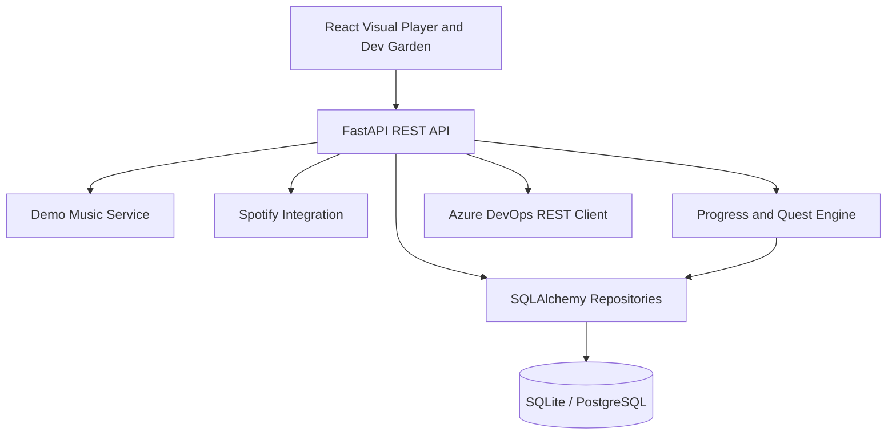

# MusicBloom Architecture

MusicBloom is a full-stack application that combines a gamified visual music
player with optional Spotify and Azure DevOps integrations.

## System overview

## Layer responsibilities

### React frontend (`web/`)

- Visual demo player with Web Audio visualization and listening-event sync
- Interactive listening garden with BloomBud mascot
- Optional Spotify mode for metadata-driven playback controls
- Dev Garden scene for Azure Pipelines health
- TanStack Query for API caching and refresh flows

### FastAPI REST API (`src/musicbloom/api/`)

- Versioned routes under `/api/v1`
- Thin route handlers that delegate to services
- Typed response models and centralized exception handlers
- OpenAPI docs at `/docs`

### Services (`src/musicbloom/services/`)

- Business logic for player sessions, progression, quests, garden, Spotify, and
  Azure DevOps
- Error mapping from external APIs into safe HTTP responses
- Demo-mode fallbacks when optional integrations are not configured

### Repositories (`src/musicbloom/repositories/`)

- SQLAlchemy-backed persistence for demo user state
- In-memory demo catalog repositories for fictional music metadata

### Integrations (`src/musicbloom/integrations/`)

- Spotify OAuth and playback metadata client
- Azure DevOps pipeline status client with retry and timeout handling

### Models (`src/musicbloom/models/`)

- Normalized domain models shared by services and API schemas

## Data flow examples

### Demo playback and progression

1. The frontend loads catalog metadata and player state from the API.
2. Demo audio plays locally in the browser.
3. Listening events are sent to `POST /api/v1/listening/events`.
4. The progression service validates events and awards Melody Points.
5. Quest and achievement evaluators update persisted progress.

### Spotify playback metadata

1. The user connects Spotify through backend OAuth.
2. Tokens are encrypted and stored server-side only.
3. The frontend polls `/api/v1/spotify/player` for normalized metadata.
4. Playback controls call backend endpoints; audio remains on Spotify devices.

### Dev Garden pipeline health

1. The Dev Garden page requests `/api/v1/devops/status` and `/runs`.
2. The backend uses Azure DevOps credentials when configured, otherwise demo data.
3. The frontend maps normalized pipeline states to visual BloomBud scenes.

## Configuration and environments

| Environment | Purpose |
|-------------|---------|
| Local development | Demo mode enabled, SQLite default, Vite proxy to FastAPI |
| CI | Demo mode enforced in tests, no external credentials |
| Docker demo | API container plus nginx frontend container |
| Production-ready config | Requires secret key, PostgreSQL URL, demo mode disabled |

## Security boundaries

- Browser clients never receive Spotify refresh tokens or Azure DevOps PATs.
- External API failures are converted into safe JSON error payloads.
- Secret values use `SecretStr` and redaction helpers before logging.

## Testing strategy

- Backend: pytest with 100% coverage on `src/musicbloom`
- Frontend: Vitest + React Testing Library
- CI: Azure Pipelines stages for lint, type check, tests, builds, and artifacts

## Related documents

- [README](../README.md)
